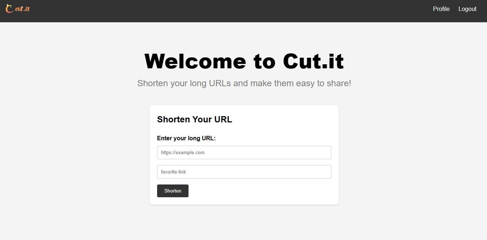
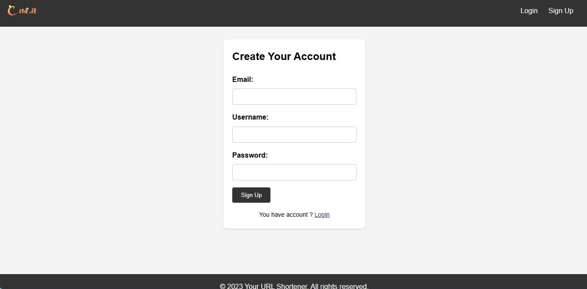

# Cut.it - URL Shortener with Ryxo Framework

[](https://opensource.org/licenses/MIT)

## Overview

Cut.it is a simple and efficient URL shortener built on the [Ryxo Framework](https://github.com/Gyanendra-baghel/ryxo) (builded by me). It allows you to create concise and memorable short links for your long URLs. Streamline your links, enhance your online presence, and track click analytics with ease.


## Getting Started

### Installation

1. Clone the Cut.it repository: `git clone https://github.com/Gyanendra-baghel/Cut.it.git`
2. Install dependencies: `composer install`
3. Navigate to the project directory: `cd public`
4. Run command: `php -S localhost:8000 -t public`
5. Visit [http://localhost:8000](http://localhost:8000) in your browser.

#### Configuration

- **Autoloading:** Ryxo follows the PSR-4 autoloading standard. Make sure the `App` namespace points to your `app/` directory.

```json
"autoload": {
    "psr-4": {
        "App\\": "app/"
    }
}
```


## Usage

1. **Login/Signup**: Use the login/signup features to manage and track your short links securely.
2. Enter your long URL in the provided input field.
3. Customize your short link if desired.
4. Click "Shorten" to generate your shortened URL.
5. Copy and share your new, streamlined link!

## Features

- **User-Friendly Interface**: Create short URLs in seconds with our intuitive platform.
- **Customization**: Tailor your short links with custom aliases for a personal touch.
- **Click Analytics**: Track the performance of your short links with detailed click analytics.
- **Login and Signup**: Securely manage your short links with user authentication features.
- **Ryxo Framework Integration**: Leverage the power of Ryxo for a robust web application foundation.

## Screenshots



## Contributing

We welcome contributions to Cut.it and Ryxo! for both projects.

## License

Cut.it and Ryxo are open-source software licensed under the [MIT License](https://opensource.org/licenses/MIT/).

## Support

For support, please open an issue on the respective GitHub repositories: [Cut.it Issues](https://github.com/Gyanendra-baghel/cut.it/issues) | [Ryxo Issues](https://github.com/Gyanendra-baghel/ryxo-framework/issues).